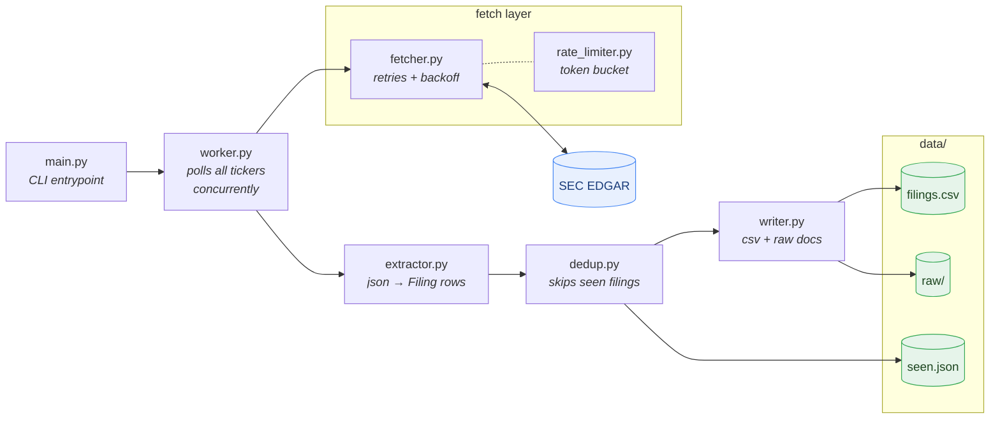

# Live Financial Streamer

CLI app that watches public tech stocks, polls SEC Edgar for new filings (10-K, 10-Q, 8-K), downloads the raw documents concurrently and flattens them into a clean csv table.

## Architecture



## How it works

- `asyncio` + `aiohttp` for concurrent downloads, all tickers polled at the same time
- `pydantic` schema (`src/schema.py`) so every row in the table has exact predictable types
- token bucket rate limiter (`src/rate_limiter.py`) to stay under the SEC 10 req/sec limit
- exponential backoff retries in the fetcher for 429s / 5xx / network errors
- dedup file so restarts dont re-download filings we already have

## Setup

```
python3 -m venv venv
source venv/bin/activate
pip install -r requirements.txt
```

## Usage

```
# poll every ticker once and exit
python main.py --once

# just some tickers
python main.py --once --tickers AAPL NVDA

# watch mode, polls every 60s untill you ctrl-c
python main.py --interval 60
```

Output lands in `data/`:
- `data/filings.csv` — the structured table
- `data/raw/` — the raw downloaded documents
- `data/seen.json` — accession numbers already proccessed

Note: each run grabs at most 5 new filings per ticker so the first run doesnt hammer the SEC, it catches up on older ones over the next runs.

## Tests

```
python -m pytest tests/ -v
```

End-to-end tests run the whole pipeline against a fake fetcher (no network), covering the csv output, raw downloads, dedup across restarts, the per-ticker cap and the rate limiter.
